# p30 用GPU训练模型（方法1）


总体思路，只需要修改3个地方的代码：

① 网络模型

② 数据（输入+标注）

③ 损失函数


找到以上3个东西，调用`.cuda()`即可

但是为了防止因为没有gpu而调用`.cuda()`时报错，在每个`.cuda()`之前添加一个if判断

加了if判断之后，代码就不会报错了（优先执行gpu，如果没有gpu再用cpu）


为了方便演示，我们将model.py文件中的class直接写到train.py中来

## 1 cpu训练的train.py代码修改

```
# cpu训练的train.py代码
# 导入模型的class
import torch
import torchvision
from torch import nn
from torch.utils.data import DataLoader
from torch.utils.tensorboard import SummaryWriter

# 1\准备数据集
train_data = torchvision.datasets.CIFAR10("./CIFAR10", train=True, transform=torchvision.transforms.ToTensor(),
                                          download=True)
test_data = torchvision.datasets.CIFAR10("./CIFAR10", train=False, transform=torchvision.transforms.ToTensor(),
                                          download=True)

# 2\查看训练数据集和测试数据集的图片数量
train_data_size = len(train_data)
test_data_size = len(test_data)
print("训练数据集的长度为：{}".format(train_data_size))
print("测试数据集的长度为：{}".format(test_data_size))

# 3\利用dataloader来加载数据集
train_loader = DataLoader(train_data, batch_size=64)
test_loader = DataLoader(test_data, batch_size=64)

# 4\创建网络模型
class Tudui(nn.Module):
    def __init__(self):
        super(Tudui, self).__init__()
        self.sequential = nn.Sequential(
            # 注意，所有的池化、卷积、线性化、非线性化。。。操作都是在torch.nn这个包里面的，因此只要导一个nn包就好了
            nn.Conv2d(in_channels=3, out_channels=32, kernel_size=5,
                   stride=1, padding=2),
            nn.MaxPool2d(kernel_size=2),

            nn.Conv2d(in_channels=32, out_channels=32, kernel_size=5,
                   stride=1, padding=2),
            nn.MaxPool2d(kernel_size=2),

            nn.Conv2d(in_channels=32, out_channels=64, kernel_size=5,
                   stride=1, padding=2),
            nn.MaxPool2d(kernel_size=2),

            nn.Flatten(),
            nn.Linear(in_features=1024, out_features=64),
            nn.Linear(in_features=64, out_features=10)
        )

    def forward(self, x):  # 编写forward函数，即各个实例化的类如何真正操作
        x = self.sequential(x)
        return x
tudui = Tudui()

# 5\创建损失函数
# 因为所有的损失函数都保存在torch.nn这个包中，因此只需要导入nn即可，然后在使用的时候加“nn.”的前缀
loss_fn = nn.CrossEntropyLoss() # 因为是分类任务，因此用交叉熵函数更合理

# 6\创建优化器optim
# 这里使用随机梯度下降的方法
# 创建优化器之前要先添加学习率,注意小数点的写法用科学计数法
learning_rate = 1e-2
optimizer = torch.optim.SGD(tudui.parameters(), lr=learning_rate)

# 10\创建tensorboard，用于打印记录loss的变化曲线
writer = SummaryWriter("./tensorboard")

# 7\设置模型训练时，要记录的一些参数
total_train_step = 0 # 记录训练的次数
total_test_step = 0 # 记录测试的次数
epoch = 10 # 设置训练的轮数，初始化为10轮训练

for i in range(epoch):
    print("------------现在开始第{}轮训练------------".format(i+1))

    # 8\开始每一step的训练
    tudui.train()
    for data in train_loader:
        imgs, targets = data
        outputs = tudui(imgs) # 模型训练
        loss = loss_fn(outputs, targets) # 求损失函数

        # 接下来是反向的优化操作
        optimizer.zero_grad() # 梯度清零
        loss.backward() # 反向传播
        optimizer.step() # grad调优

        total_train_step = total_train_step + 1
        if total_train_step % 100 == 0: # 只打印每100步的训练loss（防止无用的数据太多）
            print("训练次数为{}时，Loss为{}".format(total_train_step, loss.item())) # 注意这里展示的loss应该后面加一个item()（表示纯数字）
            # 10/将每100步的loss记录到tensorboard中(add_scalar函数专门用来记录图像的变化)
            writer.add_scalar("train_loss", loss.item(), total_train_step)

    # 9/开始新一轮的测试
    tudui.eval()
    total_test_loss = 0 # 用于记录一整轮的测试集中的loss总和
    # 12/新增total_accuracy用于记录每一轮test的总的准确率
    total_accuracy = 0
    with torch.no_grad(): # 测试过程，仅仅做测试用，不对模型有任何修改调参
        for data in test_loader:
            imgs, targets = data
            outputs = tudui(imgs)
            loss = loss_fn(outputs, targets)

            total_test_loss = total_test_loss + loss.item()

            # 12/计算每一个step中的accuracy,并添加到总的total_accuracy中
            accuracy = (outputs.argmax(1)==targets).sum()
            total_accuracy = (total_accuracy + accuracy)

        print("第{}轮测试的整体loss为：{}".format(i+1, total_test_loss))
        print("第{}轮测试的整体正确率为：{}".format(i+1, total_accuracy/test_data_size)) # 12/打印整体正确率

    # 10/将每一轮的total_test_loss也记录到tensorboard中
    writer.add_scalar("test_loss", total_test_loss, i)
    # 12/将每一轮的test中的准确率也记录到tensorboard中
    writer.add_scalar("test_accuracy", total_accuracy/test_data_size, i)

    # 11/保存每一轮训练后的模型文件（tudui_i.pth文件）
    torch.save(tudui, "tudui_{}.pth".format(i))
    print("模型已保存")

writer.close()
```


分别更改：

### ① 网络模型

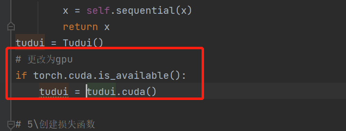

### ② 数据（输入+标签）

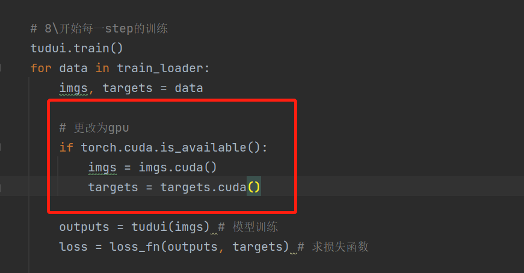

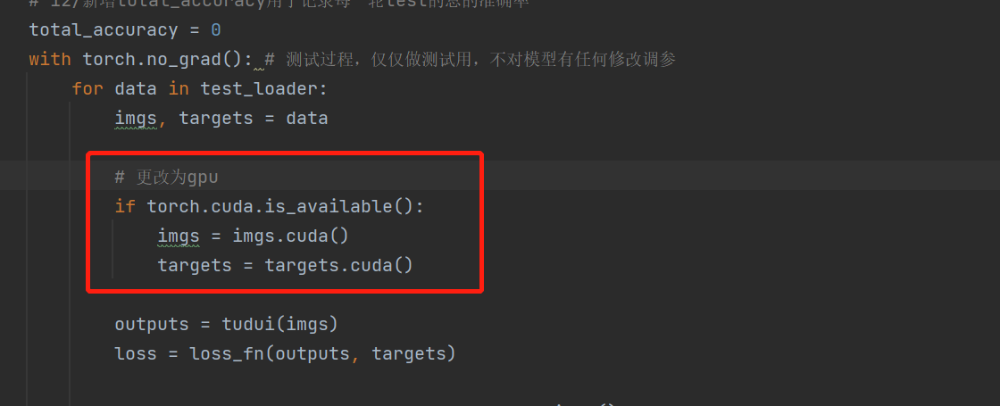


### ③ loss损失函数

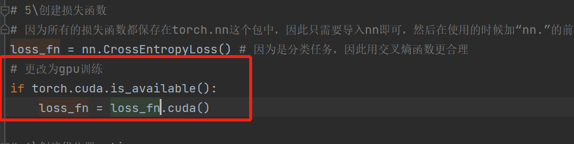


### ④ 添加计时器，记录每100step的训练时间

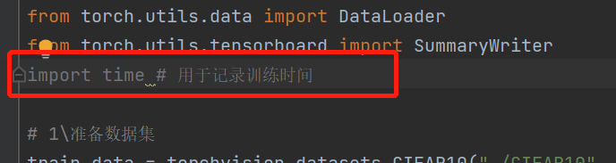

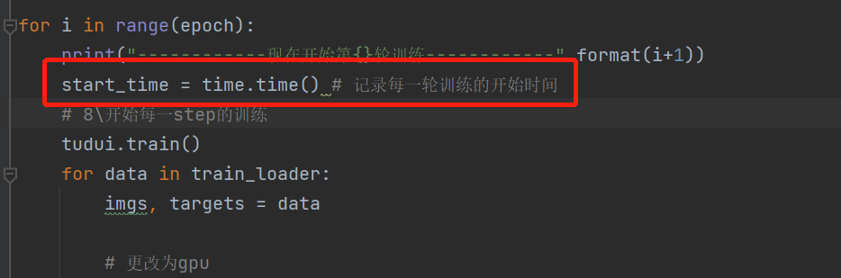

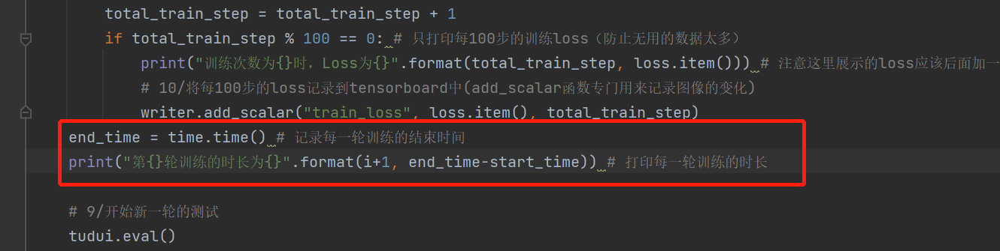


## 2 gpu训练的train.py代码

```
# 导入模型的class
import torch
import torchvision
from torch import nn
from torch.utils.data import DataLoader
from torch.utils.tensorboard import SummaryWriter
import time # 用于记录训练时间

# 1\准备数据集
train_data = torchvision.datasets.CIFAR10("./CIFAR10", train=True, transform=torchvision.transforms.ToTensor(),
                                          download=True)
test_data = torchvision.datasets.CIFAR10("./CIFAR10", train=False, transform=torchvision.transforms.ToTensor(),
                                          download=True)

# 2\查看训练数据集和测试数据集的图片数量
train_data_size = len(train_data)
test_data_size = len(test_data)
print("训练数据集的长度为：{}".format(train_data_size))
print("测试数据集的长度为：{}".format(test_data_size))

# 3\利用dataloader来加载数据集
train_loader = DataLoader(train_data, batch_size=64)
test_loader = DataLoader(test_data, batch_size=64)

# 4\创建网络模型
class Tudui(nn.Module):
    def __init__(self):
        super(Tudui, self).__init__()
        self.sequential = nn.Sequential(
            # 注意，所有的池化、卷积、线性化、非线性化。。。操作都是在torch.nn这个包里面的，因此只要导一个nn包就好了
            nn.Conv2d(in_channels=3, out_channels=32, kernel_size=5,
                   stride=1, padding=2),
            nn.MaxPool2d(kernel_size=2),

            nn.Conv2d(in_channels=32, out_channels=32, kernel_size=5,
                   stride=1, padding=2),
            nn.MaxPool2d(kernel_size=2),

            nn.Conv2d(in_channels=32, out_channels=64, kernel_size=5,
                   stride=1, padding=2),
            nn.MaxPool2d(kernel_size=2),

            nn.Flatten(),
            nn.Linear(in_features=1024, out_features=64),
            nn.Linear(in_features=64, out_features=10)
        )

    def forward(self, x):  # 编写forward函数，即各个实例化的类如何真正操作
        x = self.sequential(x)
        return x
tudui = Tudui()
# 更改为gpu
if torch.cuda.is_available():
    tudui = tudui.cuda()

# 5\创建损失函数
# 因为所有的损失函数都保存在torch.nn这个包中，因此只需要导入nn即可，然后在使用的时候加“nn.”的前缀
loss_fn = nn.CrossEntropyLoss() # 因为是分类任务，因此用交叉熵函数更合理
# 更改为gpu训练
if torch.cuda.is_available():
    loss_fn = loss_fn.cuda()

# 6\创建优化器optim
# 这里使用随机梯度下降的方法
# 创建优化器之前要先添加学习率,注意小数点的写法用科学计数法
learning_rate = 1e-2
optimizer = torch.optim.SGD(tudui.parameters(), lr=learning_rate)

# 10\创建tensorboard，用于打印记录loss的变化曲线
writer = SummaryWriter("./tensorboard")

# 7\设置模型训练时，要记录的一些参数
total_train_step = 0 # 记录训练的次数
total_test_step = 0 # 记录测试的次数
epoch = 10 # 设置训练的轮数，初始化为10轮训练

for i in range(epoch):
    print("------------现在开始第{}轮训练------------".format(i+1))
    start_time = time.time() # 记录每一轮训练的开始时间
    # 8\开始每一step的训练
    tudui.train()
    for data in train_loader:
        imgs, targets = data

        # 更改为gpu
        if torch.cuda.is_available():
            imgs = imgs.cuda()
            targets = targets.cuda()

        outputs = tudui(imgs) # 模型训练
        loss = loss_fn(outputs, targets) # 求损失函数

        # 接下来是反向的优化操作
        optimizer.zero_grad() # 梯度清零
        loss.backward() # 反向传播
        optimizer.step() # grad调优

        total_train_step = total_train_step + 1
        if total_train_step % 100 == 0: # 只打印每100步的训练loss（防止无用的数据太多）
            print("训练次数为{}时，Loss为{}".format(total_train_step, loss.item())) # 注意这里展示的loss应该后面加一个item()（表示纯数字）
            # 10/将每100步的loss记录到tensorboard中(add_scalar函数专门用来记录图像的变化)
            writer.add_scalar("train_loss", loss.item(), total_train_step)
    end_time = time.time() # 记录每一轮训练的结束时间
    print("第{}轮训练的时长为{}".format(i+1, end_time-start_time)) # 打印每一轮训练的时长

    # 9/开始新一轮的测试
    tudui.eval()
    total_test_loss = 0 # 用于记录一整轮的测试集中的loss总和
    # 12/新增total_accuracy用于记录每一轮test的总的准确率
    total_accuracy = 0
    with torch.no_grad(): # 测试过程，仅仅做测试用，不对模型有任何修改调参
        for data in test_loader:
            imgs, targets = data

            # 更改为gpu
            if torch.cuda.is_available():
                imgs = imgs.cuda()
                targets = targets.cuda()

            outputs = tudui(imgs)
            loss = loss_fn(outputs, targets)

            total_test_loss = total_test_loss + loss.item()

            # 12/计算每一个step中的accuracy,并添加到总的total_accuracy中
            accuracy = (outputs.argmax(1)==targets).sum()
            total_accuracy = (total_accuracy + accuracy)

        print("第{}轮测试的整体loss为：{}".format(i+1, total_test_loss))
        print("第{}轮测试的整体正确率为：{}".format(i+1, total_accuracy/test_data_size)) # 12/打印整体正确率

    # 10/将每一轮的total_test_loss也记录到tensorboard中
    writer.add_scalar("test_loss", total_test_loss, i)
    # 12/将每一轮的test中的准确率也记录到tensorboard中
    writer.add_scalar("test_accuracy", total_accuracy/test_data_size, i)

    # 11/保存每一轮训练后的模型文件（tudui_i.pth文件）
    torch.save(tudui, "tudui_{}.pth".format(i))
    print("模型已保存")

writer.close()
```


## 3 cpu\gpu训练的时间差距

1、cpu训练时长

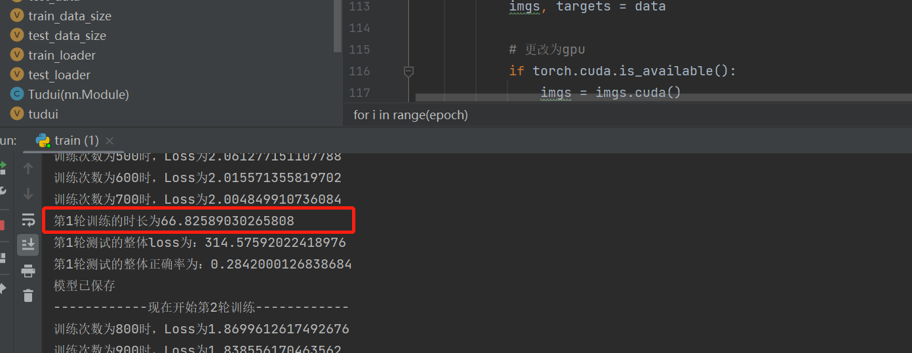

2、gpu训练时长

### 尝试试用google 的 colab 


（由于我自己的电脑里没有gpu，但是可以去[欢迎使用 Colaboratory - Colaboratory (google.com)](https://colab.research.google.com/)）

（每周有30个小时免费试用）

① 新建笔记本

② 修改 -> 笔记本设置 -> 硬件加速器改为gpu -> 保存

③ 检查gpu是否可以运行：

```
import torch
print(torch.__version__)
print(torch.cuda.is_available())
```

结果：

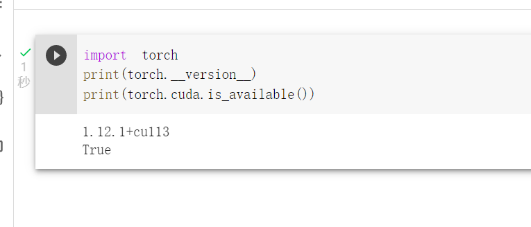


④ 直接粘贴我们的代码过去，点击运行：（可以看到速度起飞了）

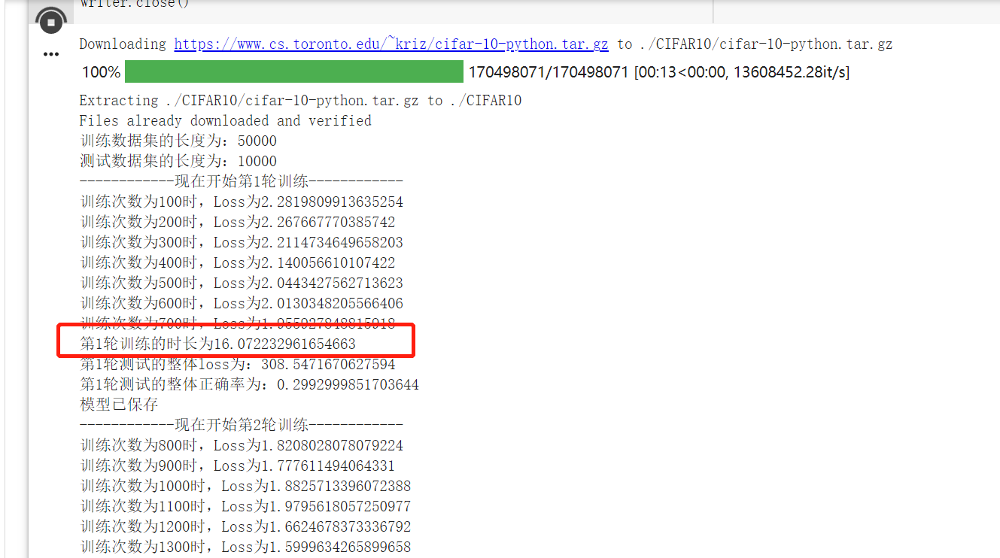


⑤ 如果想在服务器上输入terminal的执行指令，则只需要在指令之前添加`!`即可

比如，我们想查看gpu的型号：

```
!nvidia-smi
```

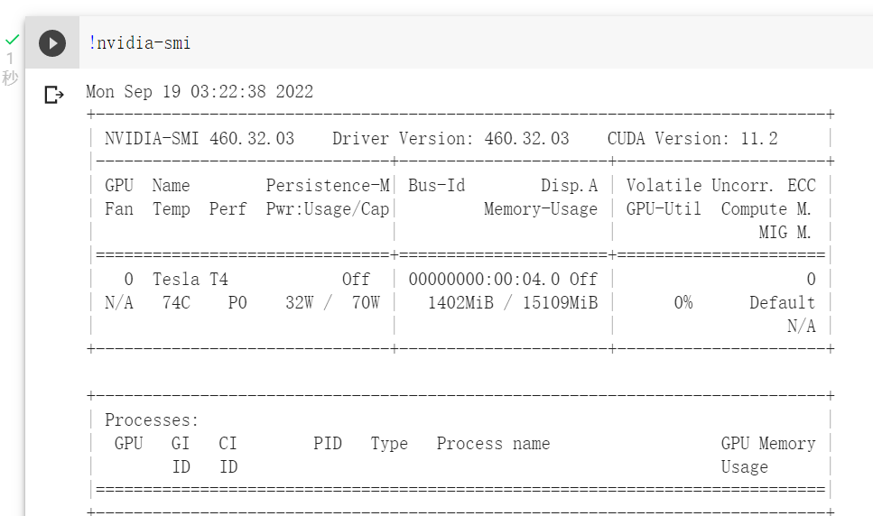


# p31 用GPU训练模型（方法2）

上一节的方法中我们发现，需要在多处添加`cuda`的代码，这样很不方便，因此，引出下面的方法：


## 1 先在最开始声明设备是cuda还是cpu

如果用gpu那就在下方红框处把“cpu”改成“cuda”

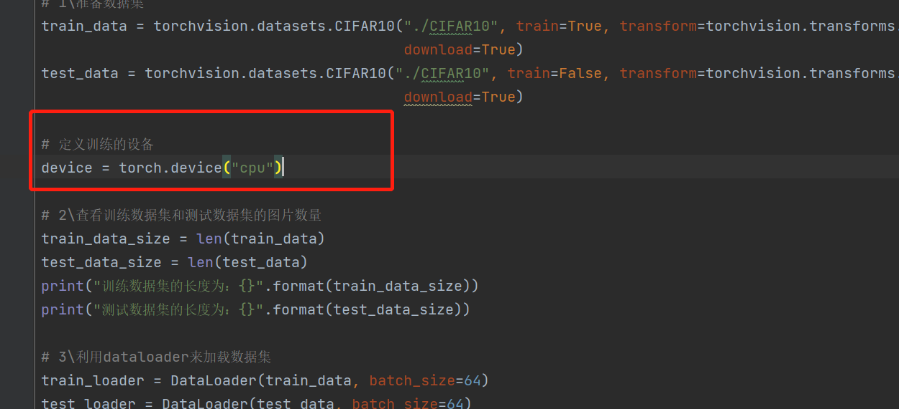


## 2 然后分别把3个地方的cuda处更改为to(device)

1、模型更改

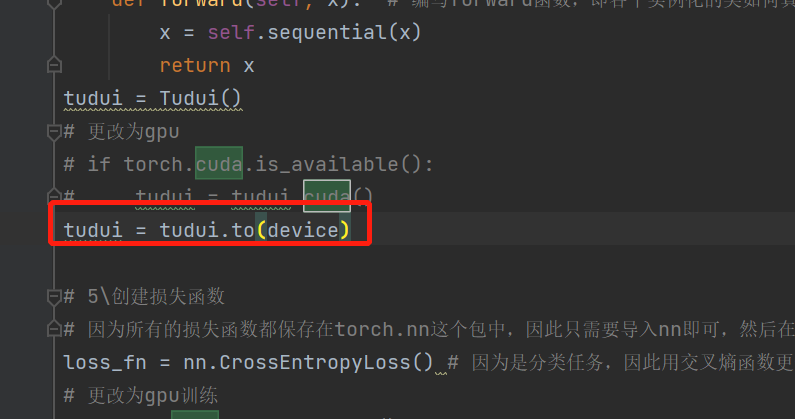

2、损失函数修改

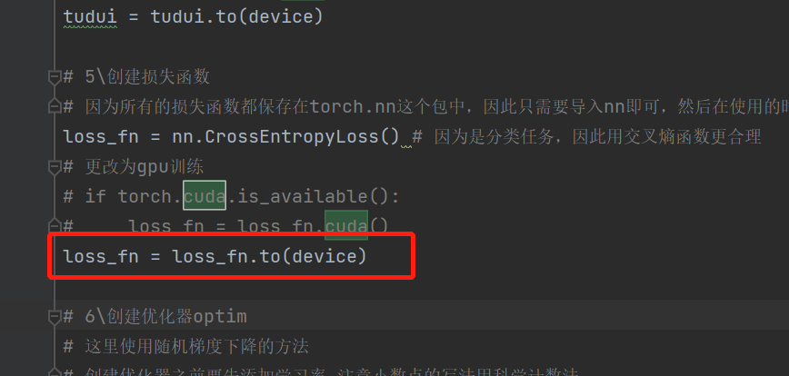

3、输入和标签修改

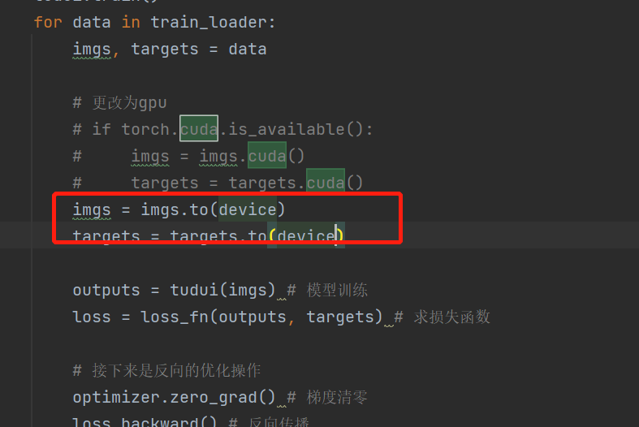

4、测试的输入和标签修改

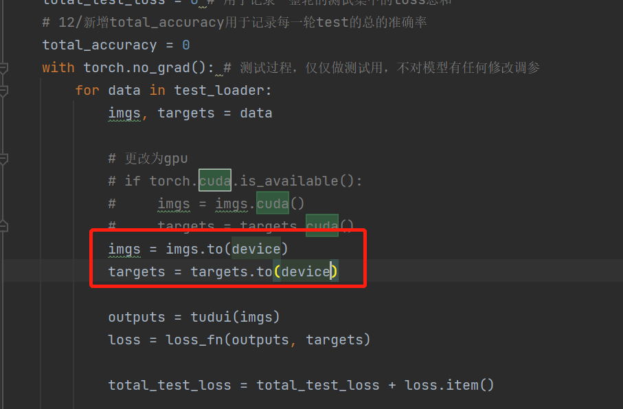

## 3 整体代码（cuda版本）：

```
# 导入模型的class
import torch
import torchvision
from torch import nn
from torch.utils.data import DataLoader
from torch.utils.tensorboard import SummaryWriter
import time # 用于记录训练时间

# 1\准备数据集
train_data = torchvision.datasets.CIFAR10("./CIFAR10", train=True, transform=torchvision.transforms.ToTensor(),
                                          download=True)
test_data = torchvision.datasets.CIFAR10("./CIFAR10", train=False, transform=torchvision.transforms.ToTensor(),
                                          download=True)

# 定义训练的设备
device = torch.device("cuda")

# 2\查看训练数据集和测试数据集的图片数量
train_data_size = len(train_data)
test_data_size = len(test_data)
print("训练数据集的长度为：{}".format(train_data_size))
print("测试数据集的长度为：{}".format(test_data_size))

# 3\利用dataloader来加载数据集
train_loader = DataLoader(train_data, batch_size=64)
test_loader = DataLoader(test_data, batch_size=64)

# 4\创建网络模型
class Tudui(nn.Module):
    def __init__(self):
        super(Tudui, self).__init__()
        self.sequential = nn.Sequential(
            # 注意，所有的池化、卷积、线性化、非线性化。。。操作都是在torch.nn这个包里面的，因此只要导一个nn包就好了
            nn.Conv2d(in_channels=3, out_channels=32, kernel_size=5,
                   stride=1, padding=2),
            nn.MaxPool2d(kernel_size=2),

            nn.Conv2d(in_channels=32, out_channels=32, kernel_size=5,
                   stride=1, padding=2),
            nn.MaxPool2d(kernel_size=2),

            nn.Conv2d(in_channels=32, out_channels=64, kernel_size=5,
                   stride=1, padding=2),
            nn.MaxPool2d(kernel_size=2),

            nn.Flatten(),
            nn.Linear(in_features=1024, out_features=64),
            nn.Linear(in_features=64, out_features=10)
        )

    def forward(self, x):  # 编写forward函数，即各个实例化的类如何真正操作
        x = self.sequential(x)
        return x
tudui = Tudui()
# 更改为gpu
# if torch.cuda.is_available():
#     tudui = tudui.cuda()
tudui = tudui.to(device)

# 5\创建损失函数
# 因为所有的损失函数都保存在torch.nn这个包中，因此只需要导入nn即可，然后在使用的时候加“nn.”的前缀
loss_fn = nn.CrossEntropyLoss() # 因为是分类任务，因此用交叉熵函数更合理
# 更改为gpu训练
# if torch.cuda.is_available():
#     loss_fn = loss_fn.cuda()
loss_fn = loss_fn.to(device)

# 6\创建优化器optim
# 这里使用随机梯度下降的方法
# 创建优化器之前要先添加学习率,注意小数点的写法用科学计数法
learning_rate = 1e-2
optimizer = torch.optim.SGD(tudui.parameters(), lr=learning_rate)

# 10\创建tensorboard，用于打印记录loss的变化曲线
writer = SummaryWriter("./tensorboard")

# 7\设置模型训练时，要记录的一些参数
total_train_step = 0 # 记录训练的次数
total_test_step = 0 # 记录测试的次数
epoch = 10 # 设置训练的轮数，初始化为10轮训练

for i in range(epoch):
    print("------------现在开始第{}轮训练------------".format(i+1))
    start_time = time.time() # 记录每一轮训练的开始时间
    # 8\开始每一step的训练
    tudui.train()
    for data in train_loader:
        imgs, targets = data

        # 更改为gpu
        # if torch.cuda.is_available():
        #     imgs = imgs.cuda()
        #     targets = targets.cuda()
        imgs = imgs.to(device)
        targets = targets.to(device)

        outputs = tudui(imgs) # 模型训练
        loss = loss_fn(outputs, targets) # 求损失函数

        # 接下来是反向的优化操作
        optimizer.zero_grad() # 梯度清零
        loss.backward() # 反向传播
        optimizer.step() # grad调优

        total_train_step = total_train_step + 1
        if total_train_step % 100 == 0: # 只打印每100步的训练loss（防止无用的数据太多）
            print("训练次数为{}时，Loss为{}".format(total_train_step, loss.item())) # 注意这里展示的loss应该后面加一个item()（表示纯数字）
            # 10/将每100步的loss记录到tensorboard中(add_scalar函数专门用来记录图像的变化)
            writer.add_scalar("train_loss", loss.item(), total_train_step)
    end_time = time.time() # 记录每一轮训练的结束时间
    print("第{}轮训练的时长为{}".format(i+1, end_time-start_time)) # 打印每一轮训练的时长

    # 9/开始新一轮的测试
    tudui.eval()
    total_test_loss = 0 # 用于记录一整轮的测试集中的loss总和
    # 12/新增total_accuracy用于记录每一轮test的总的准确率
    total_accuracy = 0
    with torch.no_grad(): # 测试过程，仅仅做测试用，不对模型有任何修改调参
        for data in test_loader:
            imgs, targets = data

            # 更改为gpu
            # if torch.cuda.is_available():
            #     imgs = imgs.cuda()
            #     targets = targets.cuda()
            imgs = imgs.to(device)
            targets = targets.to(device)

            outputs = tudui(imgs)
            loss = loss_fn(outputs, targets)

            total_test_loss = total_test_loss + loss.item()

            # 12/计算每一个step中的accuracy,并添加到总的total_accuracy中
            accuracy = (outputs.argmax(1)==targets).sum()
            total_accuracy = (total_accuracy + accuracy)

        print("第{}轮测试的整体loss为：{}".format(i+1, total_test_loss))
        print("第{}轮测试的整体正确率为：{}".format(i+1, total_accuracy/test_data_size)) # 12/打印整体正确率

    # 10/将每一轮的total_test_loss也记录到tensorboard中
    writer.add_scalar("test_loss", total_test_loss, i)
    # 12/将每一轮的test中的准确率也记录到tensorboard中
    writer.add_scalar("test_accuracy", total_accuracy/test_data_size, i)

    # 11/保存每一轮训练后的模型文件（tudui_i.pth文件）
    torch.save(tudui, "tudui_{}.pth".format(i))
    print("模型已保存")

writer.close()
```

## 4 其他细节

1、在改为cuda的过程中，其实不需要写成

```
tudui = tudui.cuda() 
或者
tudui = tudui.to(device) 
```

只需要写成

```
tudui.cuda() 
或者
tudui.to(device) 
```


但是，注意，只有模型、loss可以省略前一部分

而数据（imgs+targets）必须写完整

```
imgs = imgs.to(device)
targets = targets.to(device)
或者
imgs = imgs.cuda()
targets = targets.cuda()
```


2、如果一个电脑或者服务器中有多张gpu卡，则更加规范的写法是（对device的定义）

```
# 定义训练的设备
device = torch.device("cuda:0")
```

如果机子只有一张卡，则这句话等价于

```
# 定义训练的设备
device = torch.device("cuda")
```

这里的0，指代机子中的卡号


3、如果加上p30中的方法一种的if语句，应该这么写

```
# 定义训练的设备
device = torch.device("cuda" if torch.cuda.is_available() else "cpu")
```

即如果有gpu，优先用gpu运行，否则用cpu


# p32 完整的模型验证（测试/demo）套路


**图片分类**的模型验证的过程：

利用已经训练好的、且已经保存好的模型文件（pth格式的）

用这个文件对任意一张图片进行识别，查看模型能否正确识别出来这张图片


模型的验证文件一般写在test.py 文件中去


下面讲步骤

## 1、在pycharm中整理一份保存好的模型文件夹

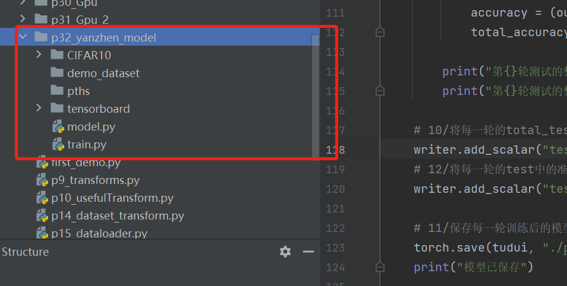

① CIFAR10是训练、测试数据集文件，它的图片只有10种分类，分别如下

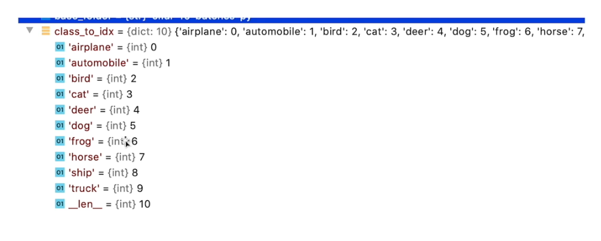

② demo_dataset是验证的图片文件（自己从网上找几张狗的图片，飞机的图片）

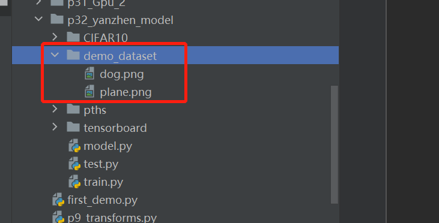

③ pths是保存好的模型文件的文件夹（这里稍微修改了一下之前的一部分代码）

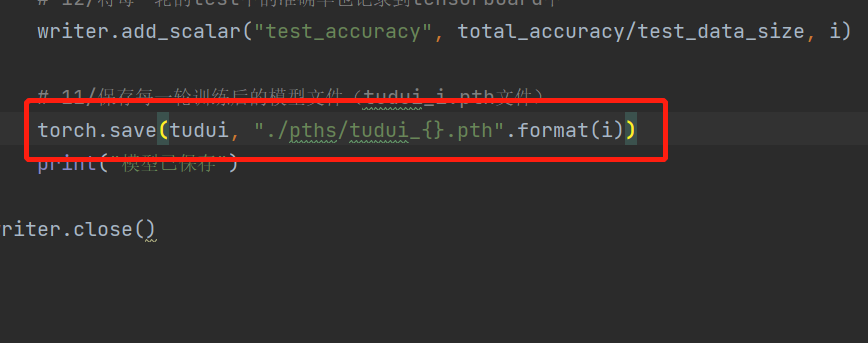

④ tensorboard 是用于存放浏览器打印的文件夹

⑤ model.py专门用于存放模型的class类

⑥ train.py 存放训练代码

然后新建一个test.py文件，专门用于存放模型验证的代码


## 2 编写test.py文件

```
import torch
import torchvision.transforms
from PIL import Image
from model import *

# 1\打开图片
img_path = "./demo_dataset/dog.png" # 测试图片的保存路径
img = Image.open(img_path)
print(img) # 打印可知png图片的通道类型是RGBA（4通道），而4通道是不能用于我们的这个模型的！

# 2\将原有的图片resize为32*32的大小，且是3通道才可以
# （因为模型的输入就是3通道、32*32大小的tensor张量）
img = img.convert('RGB') # （1）将RGBA类型的图片转为3通道的RGB类型的图片
transform = torchvision.transforms.Compose([torchvision.transforms.Resize((32, 32)), # （2）裁剪成32*32的，注意这里有两层括号！
                                            torchvision.transforms.ToTensor()]) # （3）PIL-》tensor类型的图片
img = transform(img)
img = torch.reshape(img, (1, 3, 32, 32)) # (4)图片原先是[3,32,32],这个格式不能进行模型训练，因此转换为[1,3,32,32]类型的
print(img.shape)

# 加载已有的模型
test_model = torch.load("./pths/tudui_9.pth")
print(test_model)

# 用模型来处理图片
# 切记，test验证模型的时候不修改任何梯度和参数调优，因此需要多余的两行代码
test_model.eval() # 切换为测试的模式
with torch.no_grad(): # 不更改梯度（同时，可以大大缩短模型处理的时间）
    output = test_model(img)
print(output)

# 打印output（1*10）的10个类别中，概率最大的那个类别，然后看是不是图片真正的标签
print(output.argmax(1))
```

运行后打印结果如下：

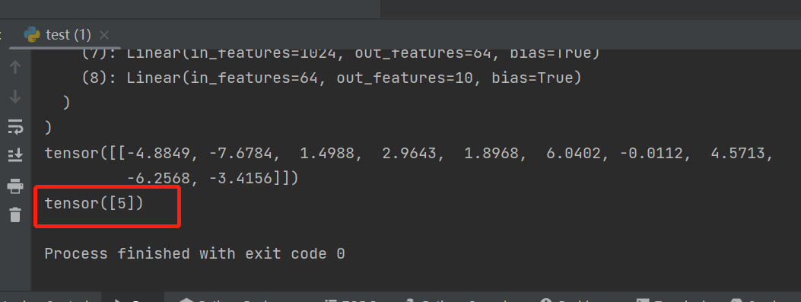

说明此刻模型对图片预测为：一只狗————————————预测对了！


后续如果想要预测其他图片，只需要把图片添加到demo_dataset文件夹中，即可


## 3 补充：如果想在服务器训练，然后把训练好的模型加载到本地验证

1、将代码在google_colab上进行更多epoch（假定为100次）的、gpu下训练


2、将模型文件下载保存到pth文件夹中

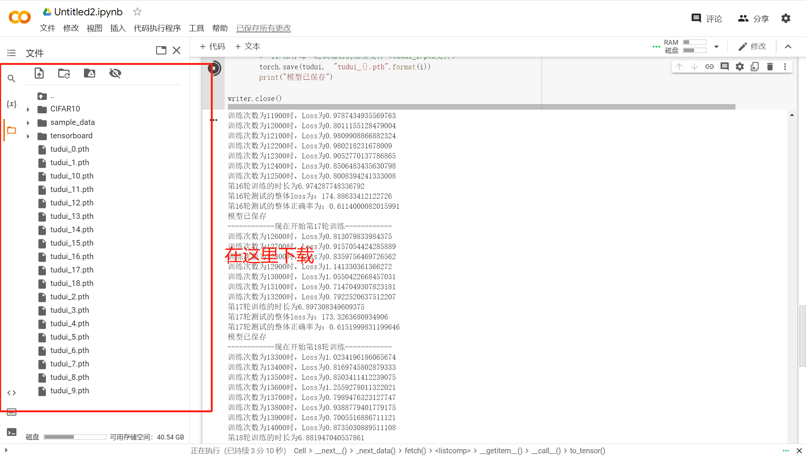

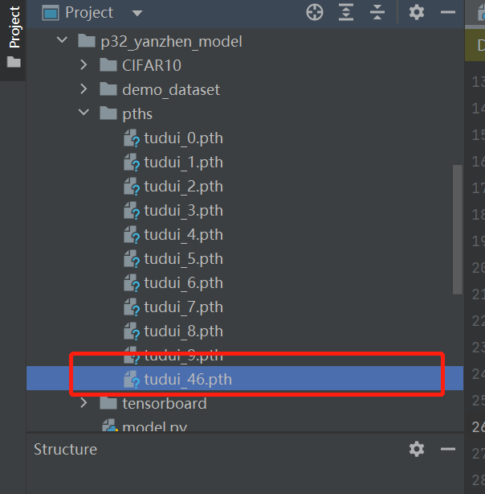

3、由于本地没有gpu，而我们下载下来的模型文件是一个gpu训练好的文件，因此在test.py文件中

在加载下载下来的模型文件时，要添加新的代码（让其转换为可以适配cpu的形式）

即，把：

```
# 加载已有的模型
test_model = torch.load("./pths/tudui_9.pth")
print(test_model)
```

更改为：

```
# 加载已有的模型
# map_location是为了防止下载下来的模型文件是cuda训练的，导致本地cpu测试不兼容 
test_model = torch.load("./pths/tudui_9.pth", map_location=torch.device('cpu'))
print(test_model)
```


# p33 看看开源项目

（略）
